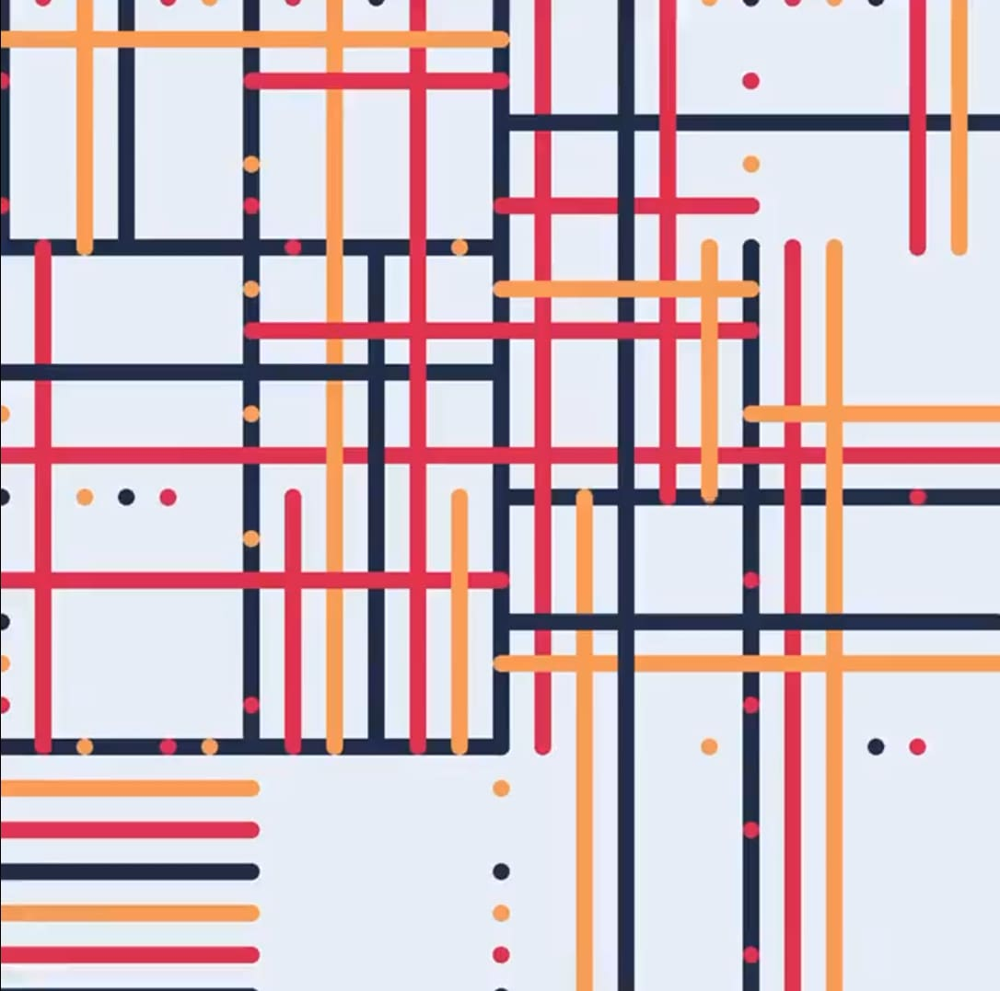
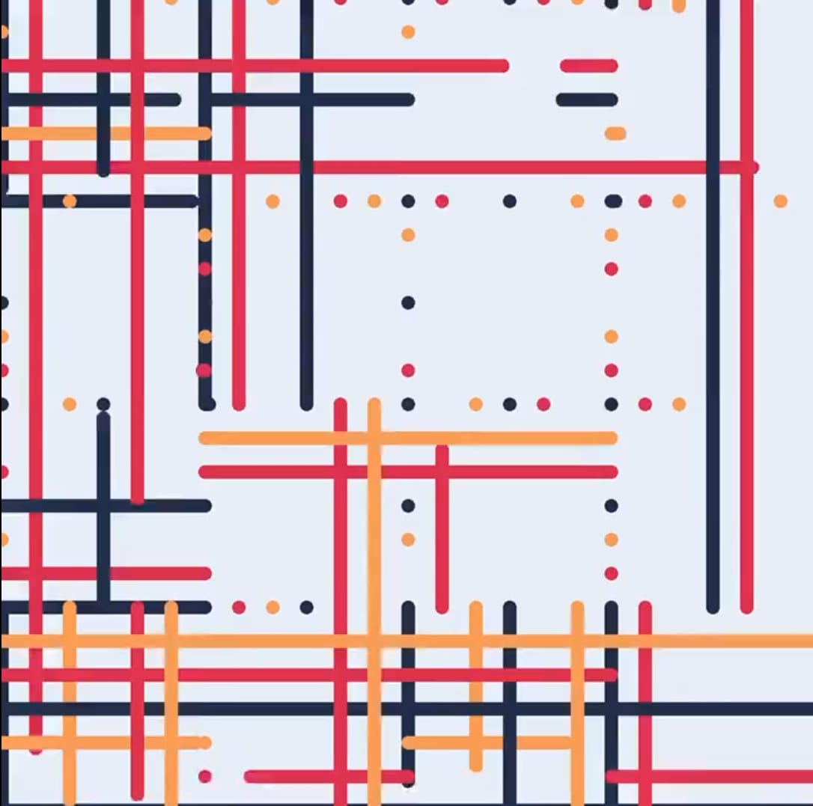
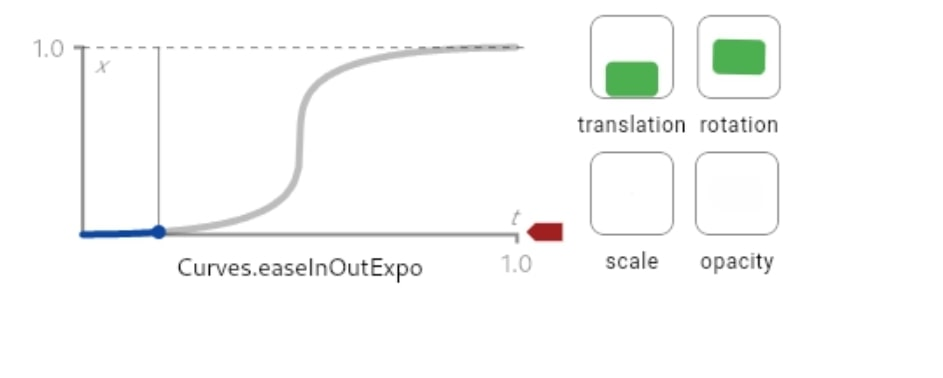

# Assignment8

## **Part 1**

This is an artwork that uses a limited set of colors and elements. The main variation of this artwork is the changing length of the lines, which can range from a single point at their shortest to extending beyond the screen at their longest. This imaging technique can be incorporated into our represent of Mondrian’s works, as they both have the characteristic of using the limited elements and colors. And by changing the limited elements, the represented artwork can become more interactive but without losing its original characteristics. 

> **Screenshot 1**

> **Screenshot 2**

## **Part 2**

A method named **easeInOutExpo()** from **fabric.js** might help contribute to our desired results described from Part 1. The major function of this method is the controlling of the rate of shapes being changed. By adjusting the rate of change at the beginning slower, then gradually speed it up, and eventually slow the rate of change down again before the end, it creates a more natural flow in the animation. This method can be applied to all the changing of the rectangles and the lines in the representation of Mondrian's artwork.

> **Screenshot 3**

[Example Link](https://api.flutter.dev/flutter/animation/Curves/easeInOutExpo-constant.html)